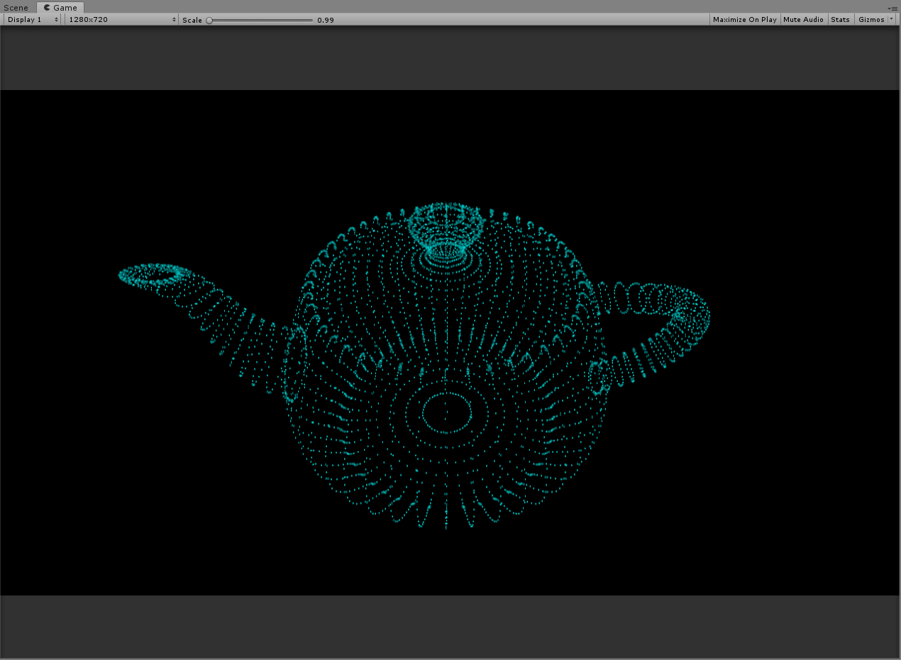
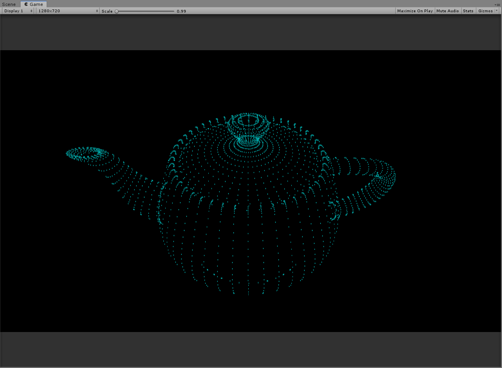
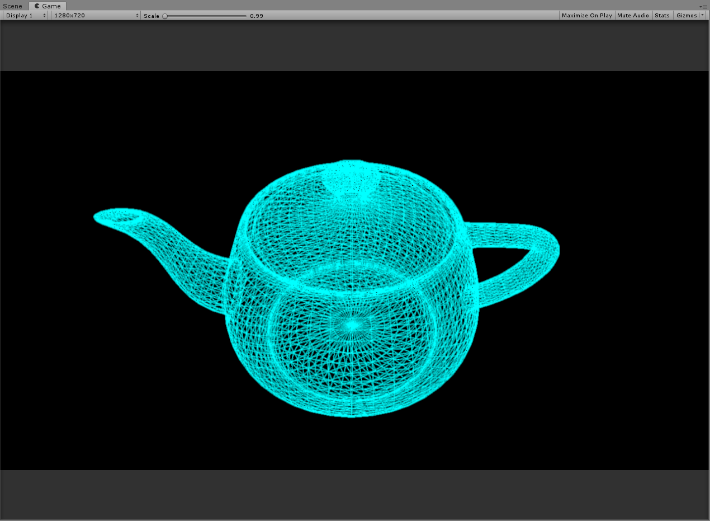
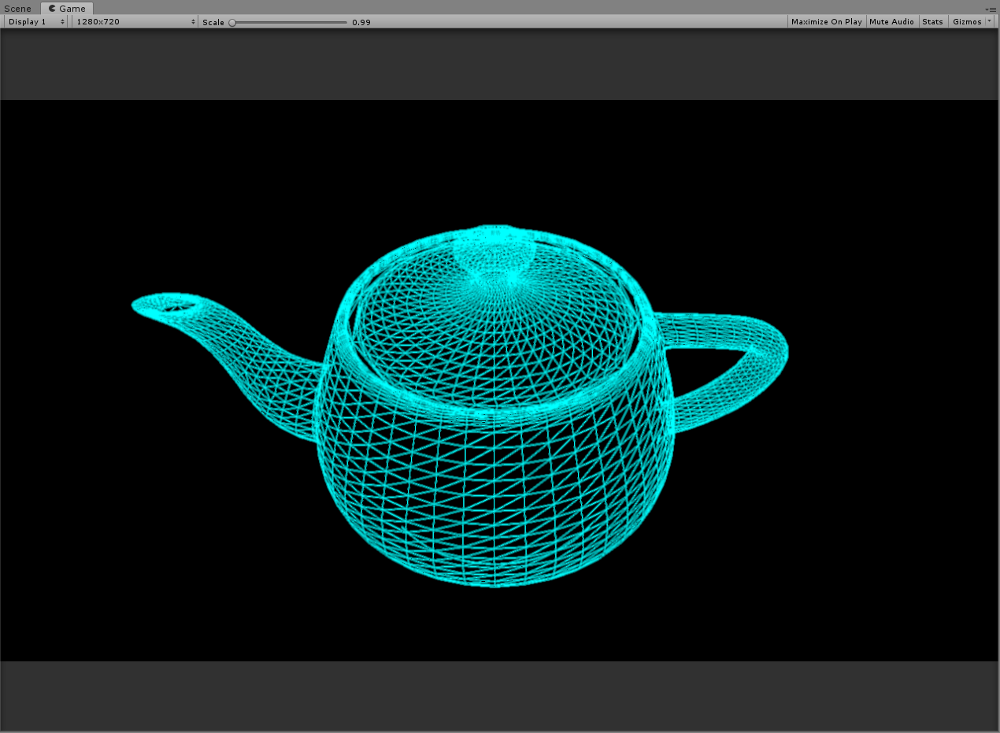
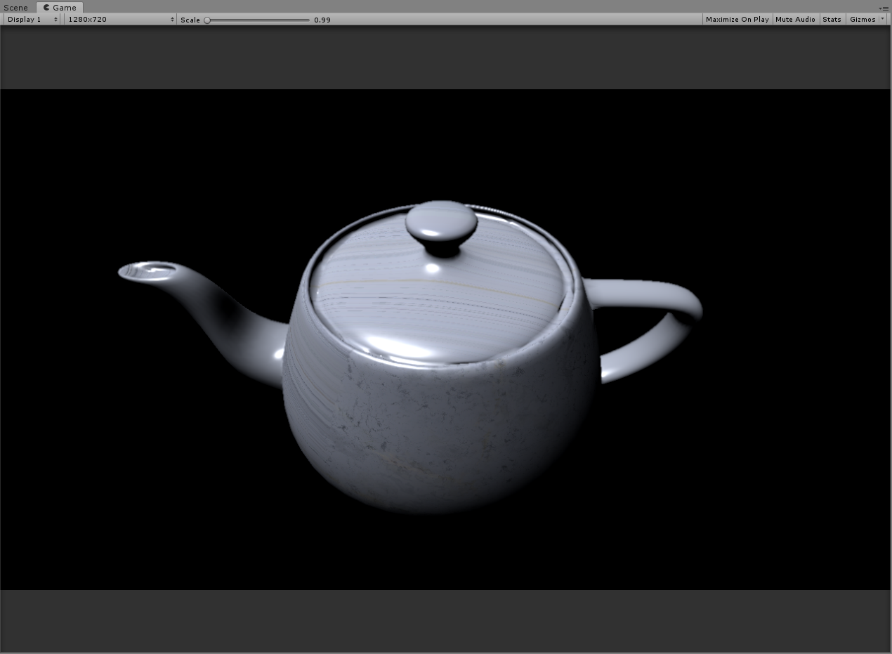
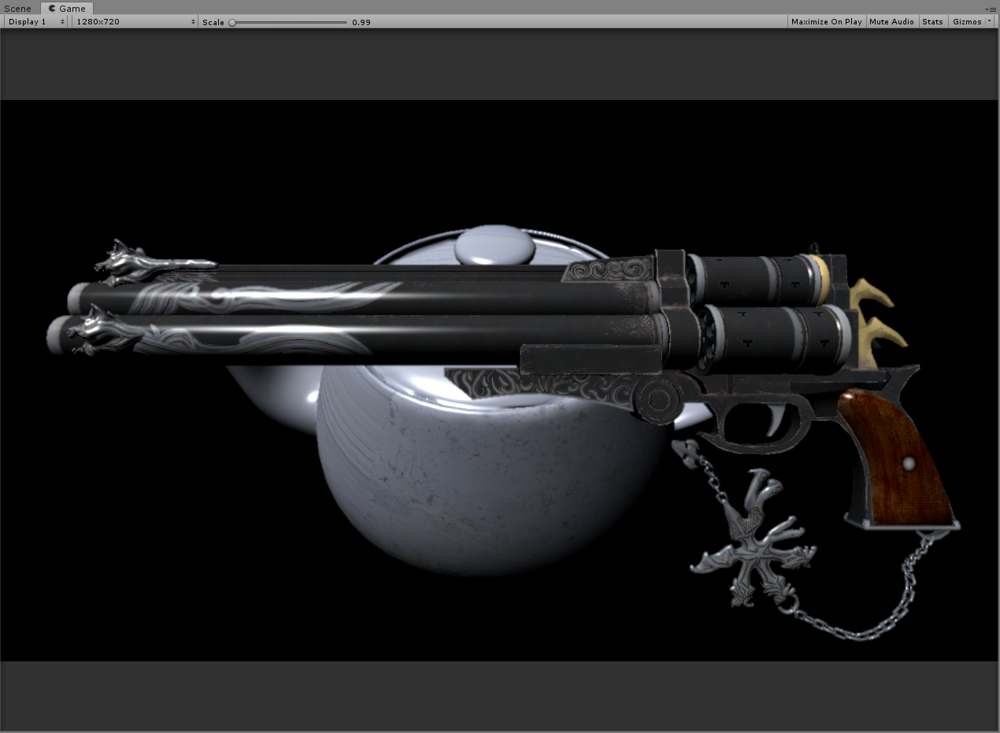
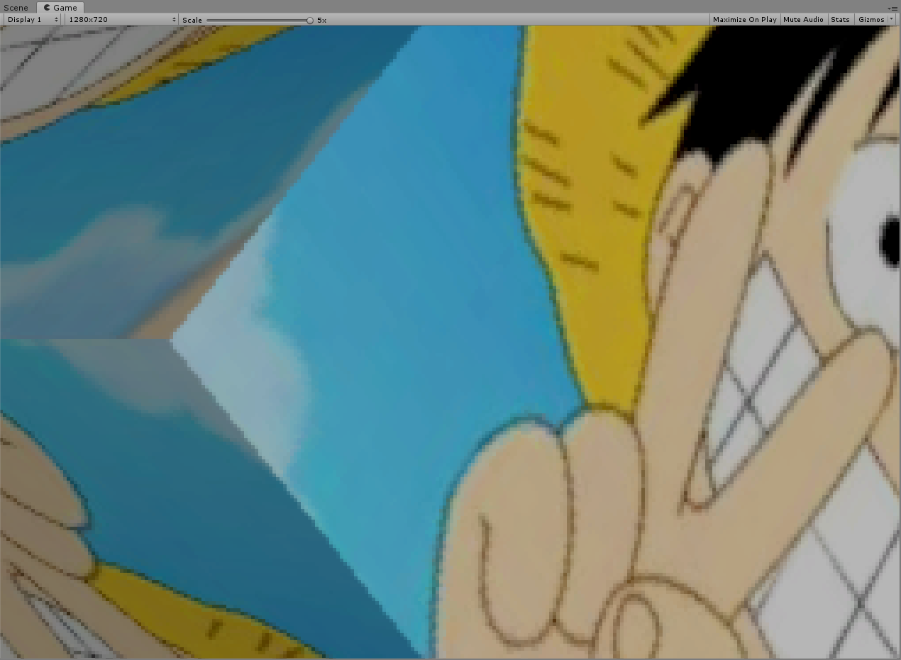

# SoftwareRendering
SoftwareRendering

项目介绍(用unity制作的光栅化渲染器)

1:获取模型数据

2:绘制三角形
(1)提前背面剔除
(2)顶点着色器 模型-世界-观察
(3)视椎体裁剪
(4)透视除法
(5)屏幕映射
(6-1)画点
(6-2)画线(Cohen–Sutherland 裁剪算法 - Bresenham画线算法)
(6-3)画三角形(包含提前深度测试)
(7)透视矫正 
(8)重心插值
(9)像素着色器

3:FXAA

-----------------------------------------------------------------------------------------------------------------------
画点(无背面剔除)

画点(背面剔除)

画线(无背面剔除)

画线(背面剔除)

画三角形

深度测试

无抗锯齿

有抗锯齿

